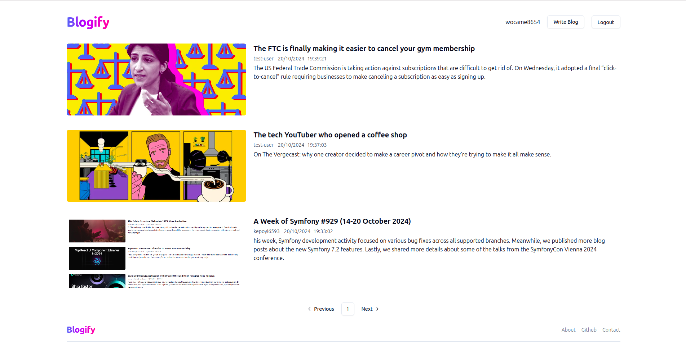

# Blogify



### User Features:

- **User Authentication**: Secure login and logout using JWT.
- **Write & Publish Blogs**: Users can create, edit, and delete their blogs.
- **Read & Interact**: Browse and interact with other users' blogs through comments.

## Installation and Setup

1. **Clone the repository**:
   ```
   git clone git@github.com:rohitbisht01/blogify-application.git
   cd blogify-application
   ```
2. **Install Dependencies**:

   ```
   # For backend
   npm install

   # For frontend
   cd frontend
   npm install
   ```

3. **Environment Variables**: Create a .env file and add the necessary configuration:

   ```
   PORT=
   MONGODB_URL=

   CLOUDINARY_CLOUD_NAME=
   CLOUDINARY_API_KEY=
   CLOUDINARY_API_SECRET=

   JWT_SECRET=
   JWT_EXPIRES_IN=
   ```

   Create a .env file in the frontend and add the necessary configuration:

   ```
   VITE_BASE_URL=backend_url
   ```

4. **Run the application:**

   ```
   # For Backend
   npm run dev
   ```

   ```
   # For Frontend
   cd frontend
   npm run dev
   ```
